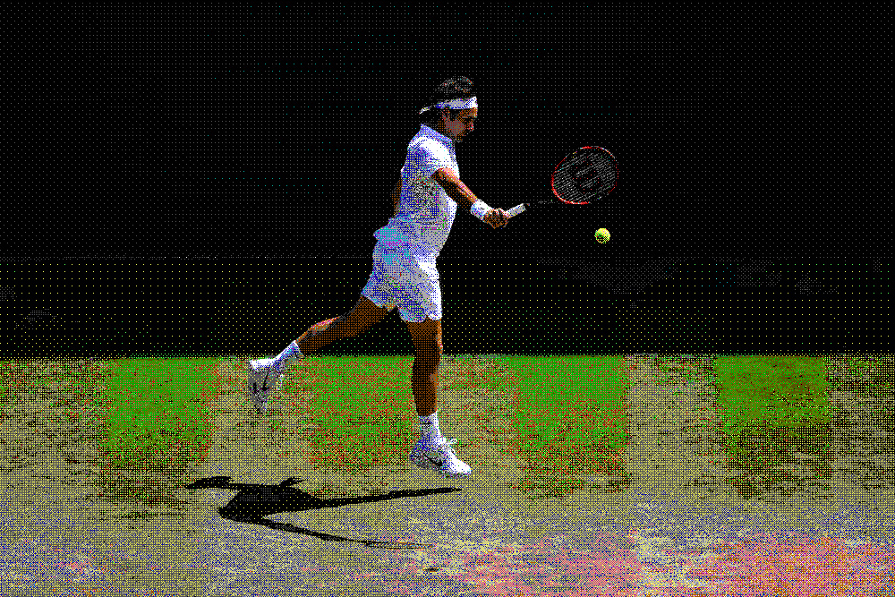

# dither

<p align="center">
  
</p>

`dither` is a small C command-line tool that converts an image to a 16-color VGA-style palette using
ordered dithering. The palette is defined in `src/palette.h`. To use different colors: edit that
file, rebuild, and rerun.

## Build

Build with:

```sh
./build.sh
```

This creates the executable at:

```sh
build/dither
```

## Usage

```sh
build/dither image-in image-out.{jpg,jpeg,png}
```

Example:

```sh
build/dither images/pieta.jpg images/pieta-dither.jpg
```
